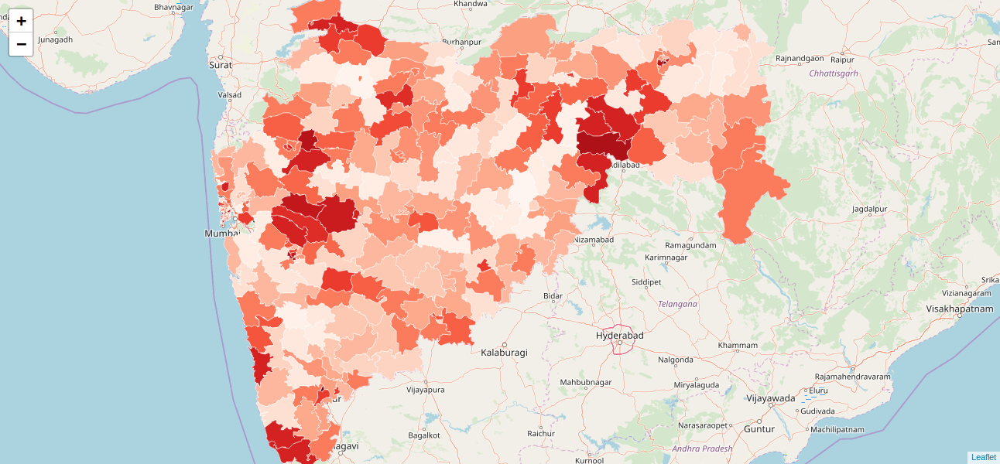

# Mapviewer Demo

This application demonstrate the use of [g1.mapviewer](https://learn.gramener.com/guide/mapviewer/),
Gramex's abstraction over [leaflet]() that creates common GIS visuals.

## Installation & Setup

1. Install gramex and its dependencies - see the [installation guide](install.md) for details.
2. Additionally, install the following packages:

```bash
$ conda install geopandas
$ npm install leaflet d3 d3-scale-chromatic
```

2. To run the app, try

```bash
$ gramex
```
in the project folder and visit [http://localhost:9988](http://localhost:9988) in your browser.
You should see a webpage that looks like this:


## Usage

### Display a map

To display any map on the webapp, drop any GeoJSON file in the upload box,
and click the "Next" button. For example, doing this with the following sample files:

* [India](https://cloud.gramener.com/f/a495212a1028427c8c33/?dl)
* [Indian Parliamentary Constituencies](https://cloud.gramener.com/f/6b197ccfa1d4492c845b/?dl)
* [Maharashtra Assembly Constituencies](https://cloud.gramener.com/f/f29f705068e84fac8b69/?dl)

should produce the following maps respectively.


### Display a choropleth

In order to make a choropleth, we need two files -
a map, and a dataset which contains the metrics to plot. As an example,
download the following files

1. [Map of Italy](https://cloud.gramener.com/f/15552c8553f343d8b1b7/?dl)
2. [Italian Unemployment Rates by Provice](https://cloud.gramener.com/f/29a0ae5347e64e77a89f/?dl)

and upload them on the [home page](http://localhost:9988). Then click "Next".

Below the map, you should see a set of inputs, as follows:


We now need to identify a column which is common between the map and the dataset.
The two files will be joined on this column. Note that the common column may have a different name
in the two files. You can pick the column in the GeoJSON map with the 'Key Column in Map' dropdown, and in the dataset with the 'Key Column in Dataset' dropdown.

In the case of the Italian map, the dataset column is "Terrorito", and the map column is "NOME\_PRO".

Finally, select the metric ("Value" for the example dataset) with the "Metric Column" dropdown,
and click on "Plot Choropleth". You should see a choropleth as follows:


### Plotting LIS of electoral regions

This example deals with a special case of a choropleth. Given a set of electoral constituencies,
we calculate the LIS - local influence score - of each constituency. The LIS for each constituency 
indicates the extent to which its neighbours voted the same way as the constituency itself.

For example, we use the results from the Maharashtra Assembly Elections of 2019.

Download the election results [here](https://cloud.gramener.com/f/a80919938bd448fb8f7e/?dl),
and use the [map of assembly constituencies in Maharashtra](https://cloud.gramener.com/f/f29f705068e84fac8b69/?dl) from the earlier example. Upload both these files on the home page and click "Next".

The two datasets can be joined on the assembly constituency numbers.
The key column in the map is named "AC\_NO" and in the results dataset it is named "ac\_no".
The metric we want to use to compute the LIS is "Party". Make the corresponding selections from
the dropdowns, and click on "Plot LIS".

You should now see the LIS choropleth as follows:


